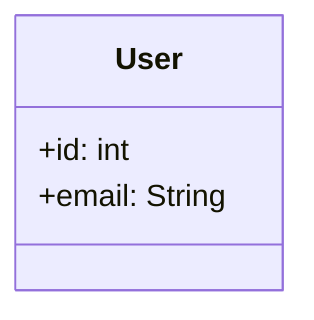
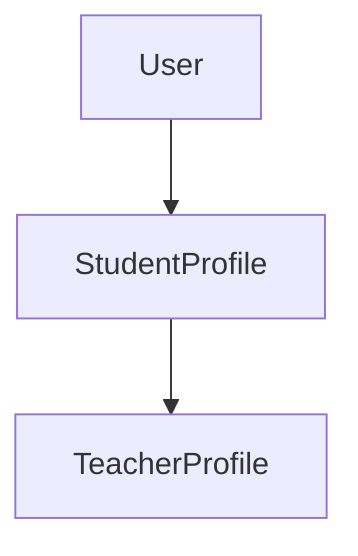
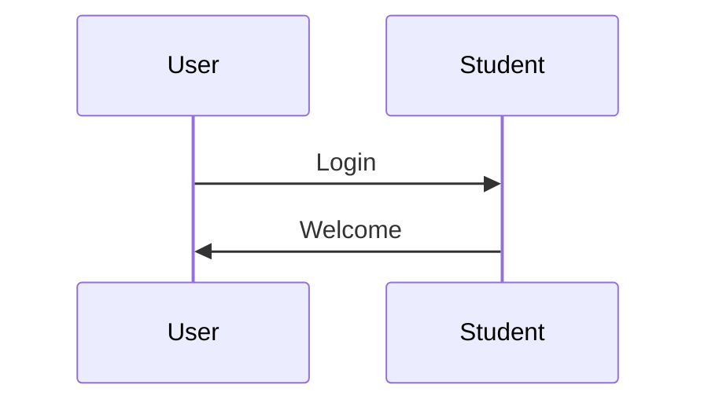

# Codes de Test Mermaid

## Test 1 : Code de base
```mermaid
classDiagram
```

## Test 2 : Une seule classe simple


## Test 3 : Deux classes avec relation
```mermaid
classDiagram
    class User {
        +id: int
        +email: String
    }
    class StudentProfile {
        +id: int
        +name: String
    }
    User ||--|| StudentProfile
```

## Test 4 : Graph simple (alternative)


## Test 5 : Diagramme de séquence simple


## Test 6 : Code complet du diagramme de classe (à tester après les tests simples)
```mermaid
classDiagram
    class User {
        +id: int
        +email: String
        +password: String
        +role: UserRole
        +created_at: DateTime
        +updated_at: DateTime
        +is_active: boolean
        +authenticate()
        +update_profile()
        +change_password()
    }

    class StudentProfile {
        +id: int
        +user_id: int
        +first_name: String
        +last_name: String
        +date_of_birth: Date
        +grade_level: int
        +learning_style: String
        +current_level: int
        +get_progress()
        +update_learning_style()
    }

    class TeacherProfile {
        +id: int
        +user_id: int
        +first_name: String
        +last_name: String
        +subject: String
        +experience_years: int
        +qualifications: String
        +get_classes()
        +create_assessment()
    }

    class ParentProfile {
        +id: int
        +user_id: int
        +first_name: String
        +last_name: String
        +phone: String
        +address: String
        +get_children()
        +view_progress()
    }

    class AdminProfile {
        +id: int
        +user_id: int
        +first_name: String
        +last_name: String
        +permissions: String[]
        +manage_users()
        +system_config()
    }

    class Class {
        +id: int
        +name: String
        +subject: String
        +teacher_id: int
        +grade_level: int
        +academic_year: String
        +schedule: String
        +get_students()
        +add_student()
        +remove_student()
    }

    class Subject {
        +id: int
        +name: String
        +description: String
        +grade_level: int
        +curriculum: String
        +get_topics()
        +get_learning_objectives()
    }

    class Topic {
        +id: int
        +subject_id: int
        +name: String
        +description: String
        +difficulty_level: int
        +estimated_duration: int
        +get_content()
        +get_assessments()
    }

    class LearningContent {
        +id: int
        +topic_id: int
        +title: String
        +content_type: String
        +content: String
        +difficulty_level: int
        +tags: String[]
        +get_related_content()
        +update_content()
    }

    class Assessment {
        +id: int
        +title: String
        +description: String
        +class_id: int
        +topic_id: int
        +assessment_type: String
        +duration: int
        +total_points: int
        +due_date: DateTime
        +create_questions()
        +grade_assessment()
    }

    class Question {
        +id: int
        +assessment_id: int
        +question_text: String
        +question_type: String
        +difficulty_level: int
        +points: int
        +correct_answer: String
        +options: String[]
        +get_answers()
        +calculate_score()
    }

    class StudentAnswer {
        +id: int
        +student_id: int
        +question_id: int
        +answer: String
        +is_correct: boolean
        +points_earned: int
        +time_taken: int
        +submitted_at: DateTime
        +grade_answer()
    }

    class AssessmentSubmission {
        +id: int
        +student_id: int
        +assessment_id: int
        +started_at: DateTime
        +submitted_at: DateTime
        +total_score: int
        +max_score: int
        +status: String
        +calculate_final_score()
        +generate_feedback()
    }

    class LearningPath {
        +id: int
        +student_id: int
        +subject_id: int
        +current_topic_id: int
        +progress_percentage: float
        +estimated_completion: DateTime
        +difficulty_adjustment: float
        +generate_next_topic()
        +adapt_difficulty()
        +update_progress()
    }

    class AdaptiveEngine {
        +id: int
        +student_id: int
        +current_level: int
        +learning_pattern: String
        +performance_history: PerformanceData[]
        +analyze_performance()
        +generate_recommendations()
        +adjust_content()
    }

    class PerformanceData {
        +id: int
        +student_id: int
        +topic_id: int
        +score: float
        +time_spent: int
        +difficulty_level: int
        +timestamp: DateTime
        +calculate_trend()
    }

    class StudyGroup {
        +id: int
        +name: String
        +description: String
        +subject_id: int
        +max_members: int
        +created_by: int
        +created_at: DateTime
        +add_member()
        +remove_member()
        +share_resource()
    }

    class GroupMember {
        +id: int
        +group_id: int
        +student_id: int
        +joined_at: DateTime
        +role: String
        +contribution_score: int
        +update_role()
        +calculate_contribution()
    }

    class SharedResource {
        +id: int
        +group_id: int
        +shared_by: int
        +title: String
        +description: String
        +resource_type: String
        +file_url: String
        +shared_at: DateTime
        +download_resource()
    }

    class Message {
        +id: int
        +sender_id: int
        +receiver_id: int
        +subject: String
        +content: String
        +message_type: String
        +sent_at: DateTime
        +is_read: boolean
        +mark_as_read()
        +reply_to_message()
    }

    class Notification {
        +id: int
        +user_id: int
        +title: String
        +message: String
        +notification_type: String
        +created_at: DateTime
        +is_read: boolean
        +priority: String
        +send_notification()
        +mark_as_read()
    }

    class Calendar {
        +id: int
        +user_id: int
        +name: String
        +description: String
        +color: String
        +is_shared: boolean
        +create_event()
        +update_event()
        +delete_event()
    }

    class CalendarEvent {
        +id: int
        +calendar_id: int
        +title: String
        +description: String
        +start_time: DateTime
        +end_time: DateTime
        +location: String
        +event_type: String
        +reminder_time: DateTime
        +set_reminder()
        +check_conflicts()
    }

    class StudySession {
        +id: int
        +student_id: int
        +subject_id: int
        +topic_id: int
        +planned_duration: int
        +actual_duration: int
        +start_time: DateTime
        +end_time: DateTime
        +goals: String[]
        +notes: String
        +track_progress()
        +complete_session()
    }

    class Homework {
        +id: int
        +title: String
        +description: String
        +class_id: int
        +subject_id: int
        +assigned_by: int
        +assigned_at: DateTime
        +due_date: DateTime
        +total_points: int
        +instructions: String
        +attachments: String[]
        +assign_to_students()
        +extend_deadline()
    }

    class HomeworkSubmission {
        +id: int
        +homework_id: int
        +student_id: int
        +submitted_at: DateTime
        +content: String
        +attachments: String[]
        +grade: float
        +feedback: String
        +graded_by: int
        +graded_at: DateTime
        +submit_homework()
        +grade_submission()
    }

    class Analytics {
        +id: int
        +user_id: int
        +data_type: String
        +data: JSON
        +created_at: DateTime
        +generate_report()
        +export_data()
    }

    class Report {
        +id: int
        +title: String
        +description: String
        +report_type: String
        +generated_by: int
        +generated_at: DateTime
        +data: JSON
        +format: String
        +generate_pdf()
        +send_email()
    }

    class Badge {
        +id: int
        +name: String
        +description: String
        +icon_url: String
        +criteria: String
        +points_value: int
        +badge_type: String
        +award_badge()
    }

    class StudentBadge {
        +id: int
        +student_id: int
        +badge_id: int
        +earned_at: DateTime
        +earned_by: String
        +display_badge()
    }

    class Achievement {
        +id: int
        +student_id: int
        +title: String
        +description: String
        +achievement_type: String
        +earned_at: DateTime
        +points_earned: int
        +unlock_achievement()
    }

    User ||--|| StudentProfile
    User ||--|| TeacherProfile
    User ||--|| ParentProfile
    User ||--|| AdminProfile
    TeacherProfile ||--o{ Class
    Class ||--o{ StudentProfile
    Class ||--|| Subject
    Subject ||--o{ Topic
    Topic ||--o{ LearningContent
    Topic ||--o{ Assessment
    Assessment ||--o{ Question
    Assessment ||--o{ AssessmentSubmission
    Question ||--o{ StudentAnswer
    StudentProfile ||--o{ AssessmentSubmission
    StudentProfile ||--o{ StudentAnswer
    StudentProfile ||--o{ HomeworkSubmission
    StudentProfile ||--o{ LearningPath
    LearningPath ||--|| AdaptiveEngine
    AdaptiveEngine ||--o{ PerformanceData
    StudyGroup ||--o{ GroupMember
    StudyGroup ||--o{ SharedResource
    StudentProfile ||--o{ GroupMember
    User ||--o{ Message
    User ||--o{ Notification
    User ||--o{ Calendar
    Calendar ||--o{ CalendarEvent
    StudentProfile ||--o{ StudySession
    TeacherProfile ||--o{ Homework
    Homework ||--o{ HomeworkSubmission
    Class ||--o{ Homework
    User ||--o{ Analytics
    User ||--o{ Report
    Badge ||--o{ StudentBadge
    StudentProfile ||--o{ StudentBadge
    StudentProfile ||--o{ Achievement
```

## Instructions de test :

1. **Testez d'abord le Test 1** (juste `classDiagram`)
2. **Si ça marche**, testez le Test 2 (une classe simple)
3. **Continuez progressivement** jusqu'au Test 6 (code complet)
4. **Notez à quel test** l'erreur apparaît

## Sites de test recommandés :

- **Mermaid Live Editor** : https://mermaid.live/
- **Mermaid Chart** : Votre projet actuel
- **GitHub/GitLab** : Dans un fichier Markdown

Testez d'abord sur Mermaid Live Editor pour confirmer que le problème vient de l'environnement Mermaid Chart !
