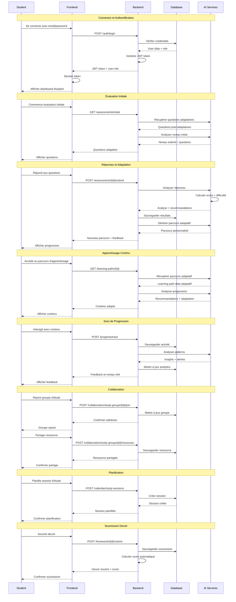

# Diagrammes de Séquence - Projet Najah AI

## 1. Diagramme de Séquence - ÉTUDIANT

## 2. Diagramme de Séquence - ENSEIGNANT

```mermaid
sequenceDiagram
    participant T as Teacher
    participant F as Frontend
    participant B as Backend _
    participant DB as Database
    participant AI as AI Services
    participant S as Student

    Note over T,AI: Connexion et Authentification
    T->>F: Se connecte avec email/password
    F->>B: POST /auth/login
    B->>DB: Vérifier credentials
    DB-->>B: User data + role teacher
    B->>B: Générer JWT token
    B-->>F: JWT token + user info
    F->>F: Stocker token
    F-->>T: Afficher dashboard enseignant

    Note over T,AI: Gestion des Classes
    T->>F: Consulte ses classes
    F->>B: GET /teacher/classes
    B->>DB: Récupérer classes du professeur
    DB-->>B: Classes data
    B-->>F: Liste des classes
    F-->>T: Afficher classes

    T->>F: Crée nouvelle classe
    F->>B: POST /teacher/classes
    B->>DB: Créer classe
    DB-->>B: Classe créée
    B-->>F: Classe créée
    F-->>T: Confirmer création

    Note over T,AI: Création d'Évaluations
    T->>F: Crée évaluation
    F->>B: POST /teacher/assessments
    B->>B: Valider données évaluation
    B->>DB: Créer évaluation
    DB-->>B: Évaluation créée
    B->>AI: Générer questions par IA
    AI-->>B: Questions générées
    B->>DB: Sauvegarder questions
    B-->>F: Évaluation créée
    F-->>T: Confirmer création

    Note over T,AI: Suivi des Élèves
    T->>F: Consulte performance classe
    F->>B: GET /teacher/classes/{id}/analytics
    B->>DB: Récupérer données classe
    DB-->>B: Performance data
    B->>AI: Analyser performances
    AI-->>B: Insights + recommandations
    B-->>F: Analytics complets
    F-->>T: Afficher analytics

    T->>F: Consulte élève spécifique
    F->>B: GET /teacher/students/{id}/progress
    B->>DB: Récupérer données élève
    DB-->>B: Student progress data
    B->>AI: Analyser progression élève
    AI-->>B: Analyse détaillée
    B-->>F: Progression élève
    F-->>T: Afficher progression

    Note over T,AI: Communication
    T->>F: Envoie message à élève
    F->>B: POST /teacher/communication/messages
    B->>DB: Sauvegarder message
    B->>F: Envoyer notification
    F-->>S: Notification reçue
    B-->>F: Message envoyé
    F-->>T: Confirmer envoi

    T->>F: Envoie message aux parents
    F->>B: POST /teacher/communication/parent-messages
    B->>DB: Sauvegarder message parent
    B-->>F: Message envoyé
    F-->>T: Confirmer envoi

    Note over T,AI: Création de Contenu
    T->>F: Crée contenu pédagogique
    F->>B: POST /teacher/content
    B->>B: Valider contenu
    B->>DB: Sauvegarder contenu
    DB-->>B: Contenu créé
    B-->>F: Contenu créé
    F-->>T: Confirmer création

    Note over T,AI: Génération de Rapports
    T->>F: Génère rapport classe
    F->>B: POST /teacher/reports/generate
    B->>DB: Récupérer données complètes
    DB-->>B: Complete class data
    B->>AI: Analyser données
    AI-->>B: Insights + prédictions
    B->>B: Générer rapport PDF
    B-->>F: Rapport généré
    F-->>T: Télécharger rapport

    Note over T,AI: Remédiation
    T->>F: Consulte alertes difficultés
    F->>B: GET /teacher/alerts
    B->>DB: Récupérer alertes
    DB-->>B: Alerts data
    B-->>F: Alertes
    F-->>T: Afficher alertes

    T->>F: Crée plan de remédiation
    F->>B: POST /teacher/remediation/plans
    B->>AI: Générer plan personnalisé
    AI-->>B: Plan de remédiation
    B->>DB: Sauvegarder plan
    B-->>F: Plan créé
    F-->>T: Confirmer création

    Note over T,AI: Notation et Feedback
    T->>F: Note soumission élève
    F->>B: PUT /teacher/homework/submissions/{id}/grade
    B->>DB: Sauvegarder note
    B->>AI: Analyser feedback
    AI-->>B: Suggestions feedback
    B->>DB: Sauvegarder feedback
    B-->>F: Note + feedback sauvegardés
    F-->>T: Confirmer notation
```

## Utilisation

Ces codes Mermaid peuvent être utilisés dans :
- GitHub (dans les fichiers .md)
- GitLab
- Notion
- Obsidian
- Tout éditeur supportant Mermaid

## Fonctionnalités couvertes

### Diagramme Étudiant :
- Connexion et authentification
- Évaluation initiale adaptative
- Apprentissage continu avec IA
- Suivi de progression
- Collaboration et groupes d'étude
- Planification de sessions
- Soumission de devoirs

### Diagramme Enseignant :
- Connexion et authentification
- Gestion des classes
- Création d'évaluations avec IA
- Suivi des performances élèves
- Communication avec élèves et parents
- Création de contenu pédagogique
- Génération de rapports
- Remédiation et alertes
- Notation et feedback
